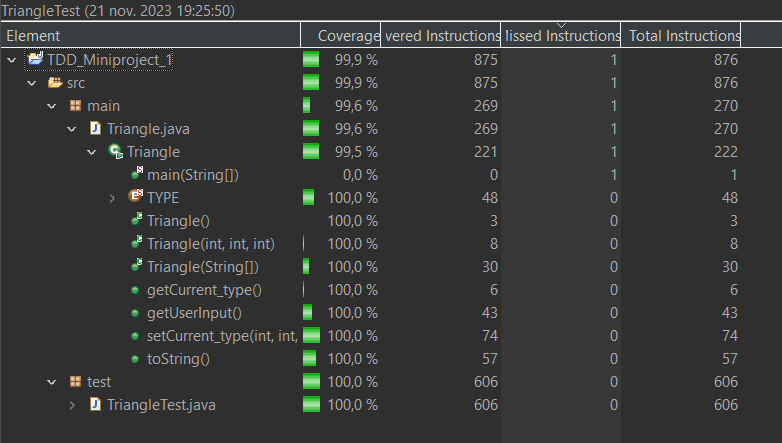

Jag vill säkerställa att när en triangel med korrekta sidor skapas, så identifieras dess typ korrekt. För detta testar jag olika scenarier: en scalene triangel, en isosceles triangel och en equilateral triangel.

Metoder som är viktiga för detta i testklassen: toStringCheckScalene, toStringCheckIsosceles, toStringCheckEquilateral.

Jag testar hur main klassen hanterar ogiltiga triangelkonfigurationer. Det inkluderar scenarier där en sida är mindre än eller lika med noll och situationer där summan av två sidor är mindre än den tredje sidan.

Metoder som är viktiga för detta i testklassen: toStringCheckNotTriangle1, toStringCheckNotTriangle2, toStringCheckNotTriangle3.

Jag vill säkerställa att main klassen korrekt hanterar ogiltig inmatning. Det inkluderar försök att skapa en triangel med bokstäver istället för siffror eller felaktig inmatning.

Metoder som är viktiga för detta i testklassen: getCurrent_typeCheckNAN, toStringCheckNAN.

Jag testar användarinteraktionen genom att simulera användarinput och sedan kontrollera om klassen hanterar det korrekt. Detta inkluderar scenarier där användaren ger ogiltig inmatning.

Metoder som är viktiga för detta i testklassen: getUserInput_toStringCheckNotTriangle1, getUserInput_toStringNAN.

Jag vill vara säker på att klassen hanterar gränsfall korrekt. Det inkluderar situationer där sidorna är noll och när de är så stora som möjligt.

Metoder som är viktiga för detta i testklassen: toStringCheckShortInput, toStringCheckLongInput.

Jag testar olika kombinationer av testfall för att säkerställa att klassen är robust och kan korrekt identifiera triangeltyper i olika scenarier, som en scalene triangel med alla sidor olika.

Metoder som är viktiga för detta i testklassen: getCurrent_typeCheckScalene, getCurrent_typeCheckIsosceles.

